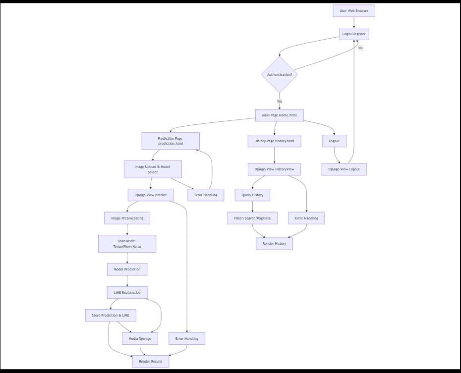

# 🧠 Lime-interpretable-Medical_Image-Classification

## Overview

This project is a full-stack web application that combines deep learning-based medical image classification with Explainable AI (XAI). It enables users to upload medical images, obtain predictions from trained models, and understand the reasoning behind those predictions through visual explanations.

The system is built using Django and integrates TensorFlow/Keras for inference and LIME for interpretability.

---

## Problem Statement

Deep learning models in healthcare often operate as black boxes, making it difficult for practitioners to trust their predictions. This system addresses that limitation by pairing predictions with interpretable visual explanations, allowing users to see which regions of an image influenced the model’s decision.

---

## Key Features

* Secure user authentication (login and registration)
* Medical image upload and preprocessing
* Deep learning-based classification
* Prediction confidence scoring
* LIME-based visual explanations (heatmaps)
* Persistent history with filtering and pagination

---

## System Architecture

The application follows the MVC (Model-View-Controller) architecture:

* Model: Defines database schema (user data, prediction history)
* View: Handles UI and presentation (HTML templates)
* Controller: Manages business logic and AI processing

### System Diagram



### Workflow

1. User logs in or registers
2. Uploads a medical image
3. Image is validated and preprocessed
4. Model performs inference
5. Prediction and confidence score are generated
6. LIME produces a visual explanation
7. Results are stored and displayed

---

## Tech Stack

### Backend

* Django (Python)
* TensorFlow / Keras
* LIME
* NumPy, PIL

### Frontend

* HTML, CSS, JavaScript (Django Templates)

### Database

* MySQL

---

## AI Pipeline

### Image Preprocessing

* Format validation
* Resizing
* Normalization
* Conversion to array format

### Model Inference

* Dynamic model loading
* Output: predicted class and confidence score

### Explainability

* LIME perturbs input data
* Highlights important regions
* Generates heatmap visualizations

---

## Installation

### Prerequisites

* Python 3.8+
* MySQL
* pip / virtual environment

### Setup

```
git clone "https://github.com/Aadhii091/Lime-interpretable-Medical_Image-Classification.git"
cd project

python -m venv venv
source venv/bin/activate   # Windows: venv\Scripts\activate

pip install -r requirements.txt

python manage.py migrate
python manage.py runserver
```

---

## Usage

1. Open the application in a browser
2. Register or log in
3. Upload a medical image
4. Select the appropriate model
5. View prediction, confidence score, and explanation
6. Access history for previous results

---

## Security

* Password hashing via Django authentication
* Session-based access control
* Restricted access for authenticated users
* Secure handling of uploaded data

---

## Limitations

* Model performance depends on training data quality
* LIME explanations are approximate
* Limited disease coverage
* Not validated for clinical deployment

---

## Future Improvements

* Real-time inference on edge devices
* Federated learning integration
* EHR system integration
* Support for multi-modal imaging (MRI, CT, X-ray)

---

